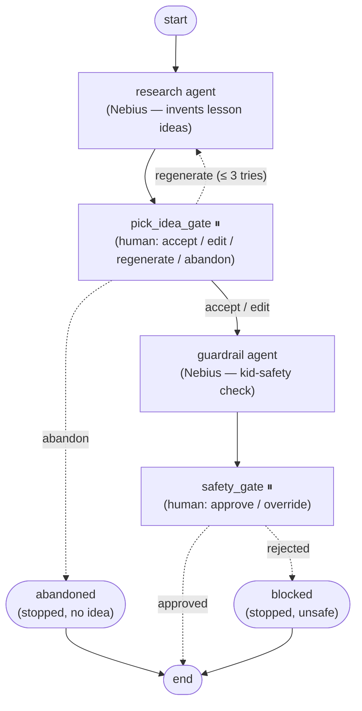

# Learn with Spark

A **Week 3 Agentic AI** project (The Gen Academy). *Learn with Spark* teaches kids how AI works
by letting them teach **Spark**, a robot with an "empty brain." Under the hood, the game levels
are generated by a **multi-agent LangGraph pipeline** — which is the real engineering substance.

We are building it backend-first (pure Python, no frontend yet), in small one-concept-at-a-time
batches. See **[PLAN.md](PLAN.md)** for the scope, requirements, and the batch-by-batch plan.

## The pipeline (graph)

Two real agents (research + guardrail) run on Nebius Token Factory, with **two human-in-the-loop
pauses** (⏸). The graph decides its own next step, can loop, and has clean stop states — it is not
on rails.



**Nodes**
- **research** — asks a model for kid-friendly, buildable lesson ideas (falls back to stub ideas if
  Nebius is unavailable, so it never crashes).
- **pick_idea_gate** ⏸ — the first human pause. A person can **accept** an idea, **edit** its fields,
  **regenerate** a fresh set (capped at 3 attempts), or **abandon** if nothing fits.
- **guardrail** — a second model reviews the whole chosen idea for age-7+ safety (stub blocklist
  fallback).
- **safety_gate** ⏸ — the second human pause. A person **approves** the verdict or **overrides** it.
- **abandoned / blocked** — clean terminal stops (gave up at research / failed safety).

> The diagram above is the architecture-diagram deliverable. Regenerate a PNG any time with:
> ```bash
> cd backend
> uv run python -c "from pipeline import build_graph, make_checkpointer; \
> build_graph(make_checkpointer()).get_graph().draw_mermaid_png(output_file_path='graph.png')"
> ```

## Getting started

```bash
cd backend
cp .env.example .env          # add your NEBIUS_API_KEY (optional: it falls back to stub ideas)
uv run python run.py          # run the pipeline; you'll pick an idea, then approve it
```

Useful flags (skip the prompts — handy for demos and tests):

```bash
uv run python run.py --pick idea_a --approve     # accept an idea + auto-approve
uv run python run.py --regenerate --approve      # reject the first sets, accept the last
uv run python run.py --abandon                   # give up at the research gate
uv run python run.py --thread t1 --stop-at-pause # stop at a pause; resume later with --resume
```

## Status

**B8.5 — research gate has real teeth.** Two real Nebius agents (research + guardrail) and two
human gates. The research gate supports accept / edit / regenerate (max 3) / abandon, and the
graph loops or stops accordingly. State is checkpointed to SQLite, so any pause can be resumed
from a separate process. Next: **B9** — the Claude coding agent that turns a chosen idea into game
code (see [PLAN.md](PLAN.md)).
