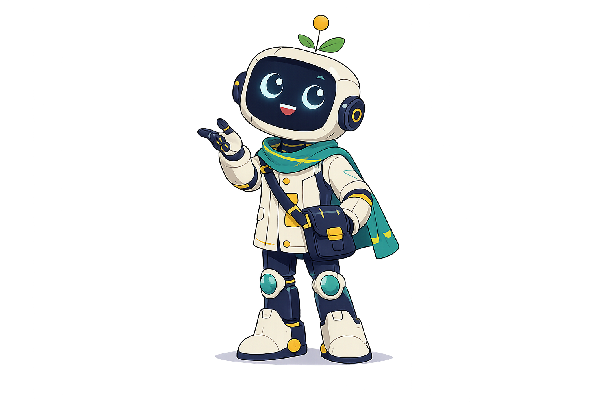
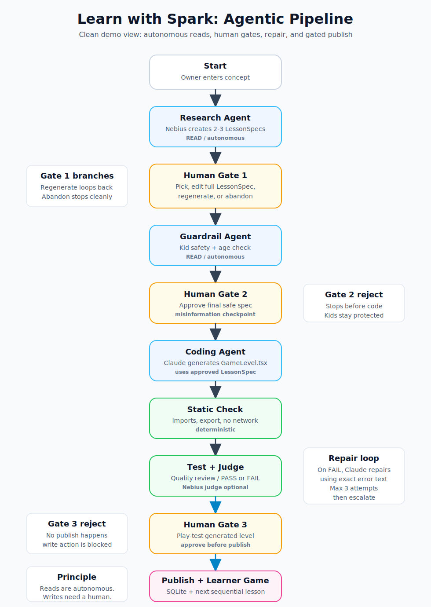

# Learn with Spark

<p align="center">
  
</p>

## Project Purpose

This project is built to demonstrate an agentic AI system using LangGraph: a multi-step workflow
with specialized agents, shared state, conditional control flow, tool usage, checkpointing,
human-in-the-loop approval, and failure recovery. The technical goal is to show how an AI system can
autonomously perform read/check/generate/test/repair steps, while requiring human approval before
any write or publish action.

My agent helps a parent or teacher create kid-friendly AI literacy game lessons in a web admin
portal, replacing the manual workflow of brainstorming a lesson, checking it for child safety,
writing a playable activity, testing it, fixing bugs, and publishing it by hand. It researches
lesson ideas, safety-checks the content, generates a React game, tests it, repairs failures, and
publishes approved levels using LangGraph, model calls, deterministic checks, Sandpack, and SQLite;
it hands off to a human at three points: choosing the lesson idea, approving the safety/factual
check, and play-testing before publish. I'll know it works when an admin can create and publish a
playable lesson in under 15 minutes, with most generated levels accepted with no more than one edit
or repair round.

## Agent Framework

| Field | Project Details |
|---|---|
| Agent goal | The agent helps an admin create a kid-friendly AI literacy game lesson from a teaching concept. It turns the concept into a safe lesson idea, generated game code, tested output, and a published level. |
| Where do people use it? | The admin uses it from the project's local admin runner/web interface. The generated lesson is then available in the learner game flow. |
| What steps does it take, in order? | 1. Research lesson ideas. 2. Human picks or edits an idea. 3. Guardrail checks safety and age fit. 4. Human approves the final lesson spec. 5. Coding agent generates the game level. 6. Testing checks the output. 7. Repair loop runs if needed. 8. Human play-tests. 9. Approved level is published. |
| What can it actually do? | It can generate lesson ideas, check child safety, generate React game code, run deterministic checks, call an LLM judge, repair failed code, save published levels, and update the learner game sequence. Read actions are autonomous; publish/write actions are gated. |
| What does it need to remember? | It remembers the concept, generated idea options, the selected LessonSpec, guardrail result, generated code, test results, repair count, approval decisions, and published level metadata across the run. |
| What should it never do? | It should never publish a level without human approval, never skip the safety gate for children's content, never run generated code outside the sandboxed/tested path, and never keep repairing forever without escalation. |
| Human-in-the-loop | Humans review at three points: picking/editing the lesson idea, approving the safety/factual check before code generation, and play-testing before publish. The human can reject, edit, regenerate, or stop the flow. |
| What happens when something breaks? | If model/tool calls fail, the system falls back or stops gracefully. If generated code fails checks, the repair node feeds the exact error back to the coding agent and retries up to three times before escalating to a human. |
| How do you know it worked? | It works when an admin can create and publish a playable, age-appropriate lesson with human approval, ideally in under 15 minutes and with no more than one edit or repair round for most generated levels. |

See **[PLAN.md](PLAN.md)** for the full scope, target architecture, and batch plan.

## The Pipeline

The graph has three model-backed agents across two providers: research + guardrail + optional
quality judge on **Nebius Token Factory**, and coding/repair on **Claude**. It has three
human-in-the-loop gates, full LessonSpec editing before build, a capped repair loop, and a gated
publish step that saves the level and appends it to the learner sequence.

<p align="center">
  
</p>

**Read tools / autonomous work:** research, guardrail review, static checks, quality judging, DB read
helpers (`get_level`, `list_levels`).

**Write tools / gated work:** publishing to SQLite and appending a generated level to the learner
game sequence. The `publish_node` only runs after Gate 3 approval, which demonstrates the project
principle: **write actions deserve a human**.

## Getting Started

Run the Admin pipeline and the learner game in two terminals:

```bash
cd backend
cp .env.example .env
uv run streamlit run app.py

cd ../frontend
npm run dev
```

Keys are optional for a demo. Without `NEBIUS_API_KEY`, research/guardrail/judge fall back to stubs.
Without `ANTHROPIC_API_KEY`, the coding node emits a small contract-shaped React stub. That means the
graph still runs end to end and can publish a test level.

The Admin portal runs the multi-agent pipeline. The frontend opens with the learner welcome page,
plays the lesson sequence, and includes the Sandpack play-test tab.

Useful CLI flows:

```bash
cd backend
uv run python run.py                         # interactive three-gate run
uv run python run.py --pick idea_a --approve --publish
uv run python run.py --pick idea_a --approve --reject-play-test
uv run python run.py --abandon
uv run python run.py --thread t1 --stop-at-pause
uv run python run.py --thread t1 --resume
```

Published levels are stored in `backend/levels.sqlite`. A dev copy of generated code is also written
under `backend/generated/` for easy Sandpack play-testing. In the current demo build, approved
published levels are also written into `frontend/src/game/levels/` and added to the learner sequence.

## Frontend Learner + Play-Test Shell

```bash
cd frontend
npm run dev
```

The frontend opens with a welcome page, then runs the learner sequence. It currently includes the
hand-built Lesson 1 and the published Lesson 2 ("Spark's Sentence Helper"); the next approved Admin
publish is appended as the next sequential lesson. It also includes a Sandpack play-test tab where a
generated `GameLevel.tsx` can be pasted and played before Gate 3 approval.

## Architecture Diagram Deliverable

The SVG graph above is the committed architecture-picture deliverable:
`docs/assets/learn-with-spark-flow.svg`.

To regenerate a LangGraph Mermaid PNG separately:

```bash
cd backend
uv run python -c "from pipeline import build_graph, make_checkpointer; build_graph(make_checkpointer()).get_graph().draw_mermaid_png(output_file_path='graph.png')"
```
